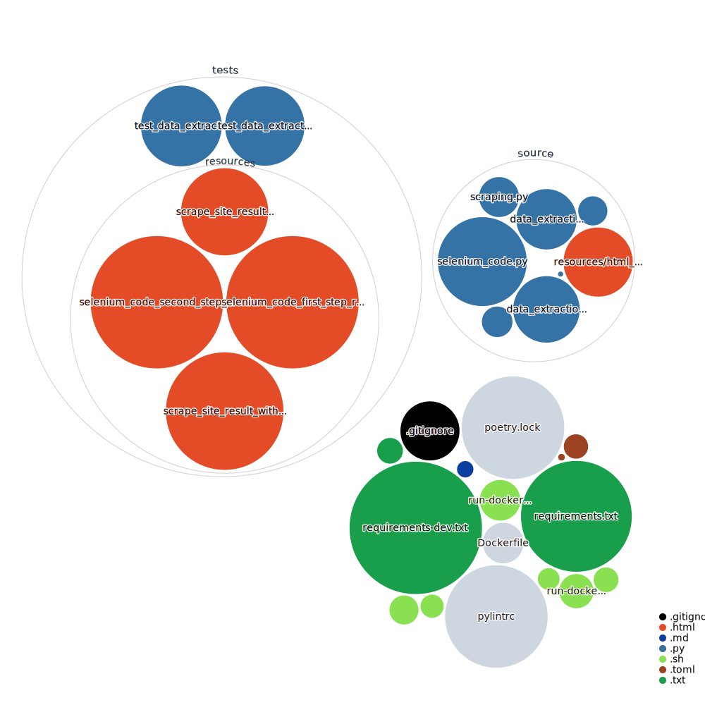

# Vivawest_scraper

**Warning**: the code has very bad ugly quality!


create a `pass.sh` in the root folder like this:
```shell
#!/bin/bash

export USERNAME="USERNAME"
export PASSWORD="SECRET"
```

# GitHub Next Code Visualization

