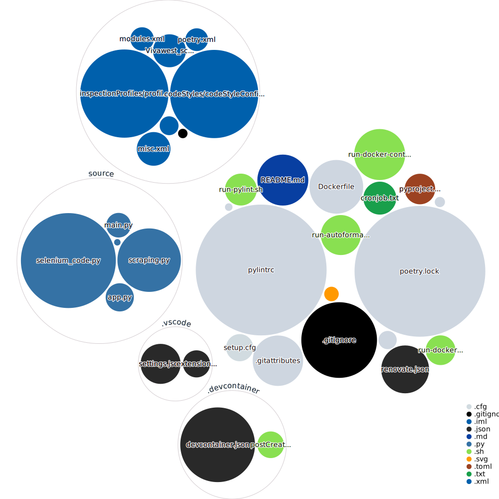

# Vivawest_scraper

**Warning**: the code has very bad ugly quality!


create a `pass.sh` in the root folder like this:
```shell
#!/bin/bash

export USERNAME="USERNAME"
export PASSWORD="SECRET"
```

## Sample Data output

```json
{
  "heizenergie": {
    "2022-5": {
      "ablesedatum": "2022-06-02T00:00:00+02:00",
      "differenz_liegenschaft_qm_prozent": 50,
      "jahr": 2022,
      "kwh": 300.0,
      "monat": 5,
      "verbrauchswert": 300000.0,
      "verbrauchswert_liegenschaft_geraete": 1800.00,
      "verbrauchswert_liegenschaft_geraete_kwh": 1.8,
      "verbrauchswert_liegenschaft_qm": 140000.0,
      "verbrauchswert_liegenschaft_qm_kwh": 140.0,
      "virtual_id": "XXX_2022-06-02"
    }
  },
  "kaltwasser": {
    "2022-5": {
      "ablesedatum": "2022-06-02T00:00:00+02:00",
      "differenz_liegenschaft_qm_prozent": 20.0,
      "jahr": 2022,
      "monat": 5,
      "verbrauchswert": 5.0,
      "verbrauchswert_liegenschaft_geraete": 0.05,
      "verbrauchswert_liegenschaft_qm": 6.0,
      "virtual_id": "XXX_2022-06-02"
    }
  }
}
```

# GitHub Next Code Visualization

